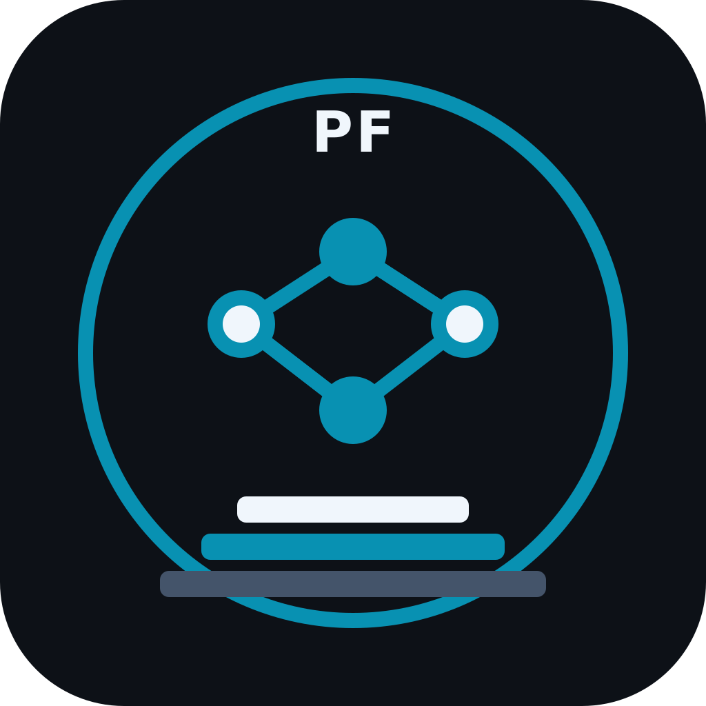

# Perfect Foundations Family

### The authoritative architecture, catalog, roadmap, and policy record for the complete Perfect ecosystem.

---

## Mission

Perfect Foundations exists to create **reusable, sharply bounded, high-assurance Rust infrastructure** beneath complex software.

The family is intentionally:

- **not a monorepo;**
- **not an umbrella runtime;**
- **not a requirement that every project use every other project;**
- **not a rewrite-everything exercise.**

Each project should be useful on its own, but stronger when composed with the right neighboring foundations.

---

## Canonical family

> **40 new planned crates + Perfectπ = 41 family members.**

Organization-support repositories such as `.github`, `perfect-family`, and `perfect-qualification` are infrastructure and are **not** counted as family crates.

### 🔢 Phase 1 — Numeric kernel

| Project | Repository | Core responsibility |
|---|---|---|
| Perfect Numeric | `perfect-numeric` | Explicit numerical semantics, rounding, conversion, representability, loss |
| Perfect Arithmetic | `perfect-arithmetic` | Exact wide/arbitrary-precision integer arithmetic |
| Perfect Rational | `perfect-rational` | Canonical exact rational arithmetic |
| Perfect Float | `perfect-float` | Arbitrary-precision binary floating point |
| Perfect Decimal | `perfect-decimal` | Exact decimal arithmetic with scale/precision preservation |

### ∑ Phase 2 — Core mathematics

| Project | Repository | Core responsibility |
|---|---|---|
| Perfect Algebra | `perfect-algebra` | Algebraic structures, fields, modules, extensions |
| Perfect Number Theory | `perfect-number-theory` | Primes, modular arithmetic, residues, factorization |
| Perfect Math | `perfect-math` | Correctly-rounded elementary math, including trigonometry |
| Perfect Complex | `perfect-complex` | Deterministic complex arithmetic |
| Perfect Interval | `perfect-interval` | Interval, ball, and complex-ball verified arithmetic |
| Perfect Polynomial | `perfect-polynomial` | Exact/certified polynomial computation |
| Perfect Special Functions | `perfect-special-functions` | Gamma, Bessel, Airy, elliptic, zeta, hypergeometric, etc. |
| Perfect Calculus | `perfect-calculus` | Differentiation, integration, limits |
| Perfect Differential Equations | `perfect-differential-equations` | ODE, DAE, PDE foundations |
| Perfect Geometry | `perfect-geometry` | Robust geometric predicates and computation |

### 🎲 Phase 3 — Probability, information, optimization & signal

| Project | Repository | Core responsibility |
|---|---|---|
| Perfect Probability | `perfect-probability` | Distributions and stochastic processes |
| Perfect Statistics | `perfect-statistics` | Descriptive/inferential/robust/streaming statistics |
| Perfect Information Theory | `perfect-information-theory` | Entropy, information measures, channels, capacity |
| Perfect Error Correction | `perfect-error-correction` | Classical FEC/ECC |
| Perfect Optimization | `perfect-optimization` | Convex, nonlinear, constrained, global optimization |
| Perfect Signal | `perfect-signal` | DSP, filtering, transforms, spectral and multirate processing |

### ⚙️ Phase 4 — Engineering foundations

| Project | Repository | Core responsibility |
|---|---|---|
| Perfect Units | `perfect-units` | Exact type-safe physical quantities and conversions |
| Perfect Uncertainty | `perfect-uncertainty` | Measurement uncertainty, covariance, propagation |
| Perfect Mechanics | `perfect-mechanics` | Kinematics, dynamics, rigid/multibody mechanics |
| Perfect Estimation | `perfect-estimation` | Filtering, smoothing, sensor fusion, factor graphs |
| Perfect Control | `perfect-control` | Feedback, state-space, optimal, nonlinear, MPC |

### ⚛️ Phase 5 — Quantum foundations

| Project | Repository | Core responsibility |
|---|---|---|
| Perfect Quantum Information | `perfect-quantum-information` | States, operators, channels, measurements, information |
| Perfect Quantum Circuits | `perfect-quantum-circuits` | Vendor-neutral quantum program representation |
| Perfect Quantum Simulation | `perfect-quantum-simulation` | Statevector, density, stabilizer, tensor/noise simulation |
| Perfect Quantum Compilation | `perfect-quantum-compilation` | Synthesis, optimization, routing, lowering |
| Perfect Quantum Error Correction | `perfect-quantum-error-correction` | QEC codes, decoders, detectors, fault tolerance |

### 🌐 Phase 6 — Applied foundational domains

| Project | Repository | Core responsibility |
|---|---|---|
| Perfect Finance | `perfect-finance` | Quantitative finance, conventions, pricing, risk |
| Perfect Meteorology | `perfect-meteorology` | Atmospheric physics and meteorological calculations |
| Perfect Navigation | `perfect-navigation` | Frames, inertial navigation, geodesy, guidance |
| Perfect GNSS | `perfect-gnss` | Multi-constellation positioning, RTK, PPP, integrity |
| Perfect Biosignal | `perfect-biosignal` | Physiological waveform representation/processing/provenance |

### 🔐 Phase 7 — Representation, evidence & authoritative data

| Project | Repository | Core responsibility |
|---|---|---|
| Perfect Wire | `perfect-wire` | Canonical deterministic bytes |
| Perfect Evidence | `perfect-evidence` | Provenance, derivation, verification, traceability |
| Perfect CODATA | `perfect-codata` | Versioned CODATA constants, uncertainty, correlation, provenance |
| Perfect Constants | `perfect-constants` | Unified authoritative constants interface |

### π Existing specialist

| Project | Repository | Core responsibility |
|---|---|---|
| Perfectπ | `DrTomLLC/perfect-pi` | Universal deterministic resource-explicit π infrastructure |

---

## Architectural shape

| Architectural layer | Primary flow |
|---|---|
| **Numeric kernel** | Perfect Numeric → Perfect Arithmetic → Perfect Rational / Float / Decimal |
| **Core mathematics** | Numeric foundations → Perfect Math → Complex / Interval / Algebra / Number Theory / Polynomial |
| **Analysis** | Interval + Algebra/Polynomial → Calculus / Differential Equations |
| **Probability & information** | Math → Probability / Statistics / Information Theory |
| **Engineering** | Calculus + Geometry + Probability → Optimization / Mechanics / Estimation / Control |
| **Quantum** | Complex + Math + Probability → Quantum Information / Circuits / Simulation / Compilation / QEC |
| **Applied foundations** | Engineering + Probability → Finance / Meteorology / Navigation / GNSS / Biosignal |
| **Representation & evidence** | Applied/domain values → Perfect Wire → Perfect Evidence |
| **Authoritative data** | Evidence + measurement foundations → Perfect CODATA → Perfect Constants |
| **Perfectπ** | Specialist source for π-dependent mathematics and π constants; never a general utility dependency |

**Important:** this is a conceptual map, not a final Cargo dependency graph.

---

## What a Perfect project must earn

A project belongs in this family only when it has a clear foundational reason to exist.

A new member should satisfy at least one of these:

1. A foundational capability is genuinely missing or fragmented.
2. Serious Rust users still need a foreign-language runtime for the core capability.
3. Multiple projects need the same primitive with a stable independent contract.
4. Existing implementations cannot meet required exactness, determinism, safety, resource, or verification semantics.

**Brand expansion alone is not a reason.**

---

## Default-grade ecosystem target

Perfect Foundations is being designed for more than local application use. The mature target is a family of crates that Rust developers, operating-system/distribution maintainers, and infrastructure projects can choose confidently as foundational dependencies.

A crate does **not** reach that bar merely by having a good API or passing unit tests. Default-grade readiness requires:

- stable source and semantic contracts;
- offline/reproducible Cargo packaging;
- no hidden build-time network access;
- minimal, auditable dependencies;
- documented MSRV and target support;
- cross-compilation;
- appropriate `no_std` support;
- supply-chain and unsafe-code review;
- independent correctness/reference evidence;
- representative performance/resource evidence;
- docs.rs/crates.io-quality documentation;
- cross-family qualification where applicable.

See [Adoption Standard](docs/ADOPTION-STANDARD.md), [Distro Readiness](docs/DISTRO-READINESS.md), [API Stability](docs/API-STABILITY.md), [Release Quality Gates](docs/RELEASE-QUALITY-GATES.md), and [Supply-Chain Security](docs/SUPPLY-CHAIN-SECURITY.md).

This is an engineering objective, not a current claim of official Rust or Linux-distribution endorsement.

---

## Family-wide engineering bar

| Area | Direction |
|---|---|
| Language | Rust-first; Pure Rust core where practical |
| Correctness | Explicit semantics before optimization |
| Failure | Panic-free normal production paths as a goal |
| Precision | Explicit rounding/loss/approximation contracts |
| Determinism | Defined and tested where meaningful |
| Resources | Explicit/bounded/caller-controlled where appropriate |
| `no_std` | Supported where the domain reasonably permits |
| FFI | Optional, isolated, documented, justified |
| Verification | Independent references + domain-appropriate hardening |
| Dependencies | Minimal and materially justified |
| Architecture | Independent crates forming a DAG |

---

## Perfectπ rule

Perfectπ stays **strictly π-focused**.

Other family projects may:

- depend on Perfectπ when they actually need π;
- reuse/adapt algorithms, implementation techniques, verification methods, or engineering patterns from Perfectπ;
- generalize reusable internals into the appropriate new crate.

They must **not** make Perfectπ an unrelated utility dependency.

Perfectπ remains under **[DrTomLLC/perfect-pi](https://github.com/DrTomLLC/perfect-pi)** until it is complete and in service.

---

## Authoritative records

| Record | Purpose |
|---|---|
| [`catalog.toml`](catalog.toml) | Machine-readable family catalog |
| [Architecture](docs/ARCHITECTURE.md) | Layering and family shape |
| [Dependency Map](docs/DEPENDENCY-MAP.md) | Provisional relationship map |
| [Build Order](docs/BUILD-ORDER.md) | Recommended implementation phases |
| [Engineering Standard](docs/ENGINEERING-STANDARD.md) | Family quality rules |
| [Reuse Policy](docs/REUSE-POLICY.md) | When to depend, copy/adapt, or reuse methods |
| [FFI Policy](docs/FFI-POLICY.md) | Foreign-runtime boundaries |
| [Scope Boundaries](docs/SCOPE-BOUNDARIES.md) | What is intentionally not being built |
| [Repository Lifecycle](docs/REPOSITORY-LIFECYCLE.md) | Reserved → architecture → implementation → stable |
| [Decisions](docs/DECISIONS.md) | Preserved founding decisions |
| [Glossary & Terminology](docs/GLOSSARY.md) | Canonical meanings for guarantees, status, evidence, compatibility, and architecture terms |
| [ADR Standard](docs/ADR-STANDARD.md) | Durable architecture decision-record rules and required fields |
| [Requirements & Traceability](docs/REQUIREMENTS-TRACEABILITY.md) | Requirement identity, status, and Requirement → Design → Implementation → Evidence chain |
| [Presentation Standard](docs/PRESENTATION-STANDARD.md) | Visual and information standard for family repository pages |
| [Status System](docs/STATUS-SYSTEM.md) | Gate-based live progress, readiness, health, and synchronization rules |
| [Adoption Standard](docs/ADOPTION-STANDARD.md) | Criteria for becoming a credible default foundational Rust choice |
| [Distro Readiness](docs/DISTRO-READINESS.md) | Linux/offline/reproducible packaging requirements |
| [API Stability](docs/API-STABILITY.md) | Source and semantic compatibility policy |
| [Release Quality Gates](docs/RELEASE-QUALITY-GATES.md) | Evidence gates from architecture through stable release |
| [crates.io Readiness](docs/CRATES-IO-READINESS.md) | Private package readiness, Perfect-to-Perfect dependency bridging, and final bottom-up registry publication |
| [crates.io Name Audit](docs/CRATES-IO-NAME-AUDIT.md) | Point-in-time availability audit for all planned registry package names |
| [Supply-Chain Security](docs/SUPPLY-CHAIN-SECURITY.md) | Dependency, build-script, unsafe-code, and provenance policy |

---

## Current family live status

Every one of the **40 planned Perfect crates** now has an authoritative machine-readable status record, a detailed README dashboard, a Project Blueprint current-state summary, and a synchronized row in the Perfect Family GitHub Project.

| Family status | Current value |
|---|---:|
| Planned crates with status source | **40 / 40** |
| README live dashboards | **40 / 40** |
| Blueprint current-state summaries | **40 / 40** |
| GitHub Project crate rows | **40 / 40** |
| Live-status workflows | **40 / 40** |
| Current lifecycle | **Architecture** |
| Current milestone | **M0 — Architecture** |
| Baseline overall progress | **12%** |
| Baseline architecture progress | **60%** |
| Baseline implementation | **0%** |
| Baseline verification | **0%** |
| Baseline distro readiness | **0%** |
| Baseline default-grade readiness | **10%** |
| Current critical blockers | **0 recorded** |

These values are gate-based, not activity-based. Commits, lines of code, PR count, and time spent do not create progress.

### How the live status works

`project-status.toml` is authoritative for each crate. A shared GitHub Actions renderer validates the score math and regenerates the visible README and blueprint status sections whenever that status source changes.

The central [Perfect Family Project](https://github.com/orgs/Perfect-Foundations/projects/1) provides the portfolio view with progress, readiness, phase, milestone, blocker, CI, audit, qualification, MSRV, visibility, and release fields.

See the [Status System](docs/STATUS-SYSTEM.md) for scoring rules, gate definitions, automation, staleness rules, and synchronization behavior.

> Perfectπ remains outside this status rollout while it is protected in its existing repository until complete and in service.

---

## Current lifecycle

| **Reserved** | → | **Architecture** | → | **Implementation** | → | **Hardening** | → | **Qualification** | → | **Prerelease / RC** | → | **Stable** | → | **Maintenance** |
|:---:|:---:|:---:|:---:|:---:|:---:|:---:|:---:|:---:|:---:|:---:|:---:|:---:|:---:|:---:|

The 40 new project repositories are currently **reserved / architecture planning**.

---

### The goal is not more crates. The goal is better foundations.

